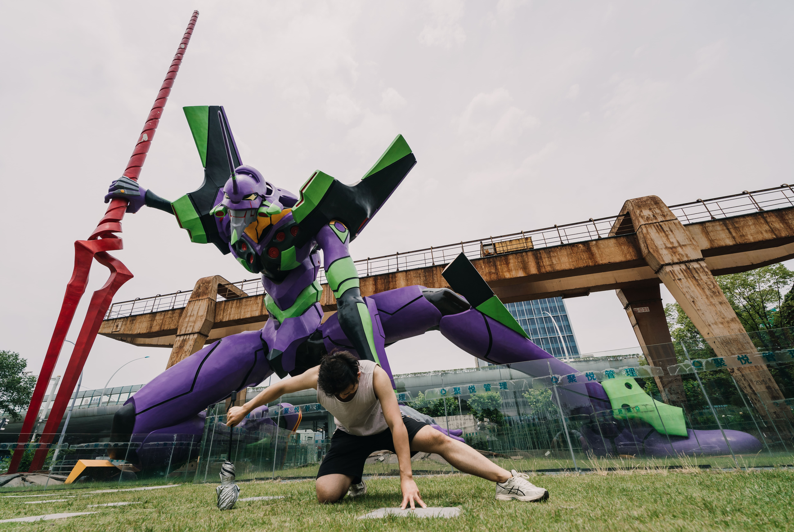
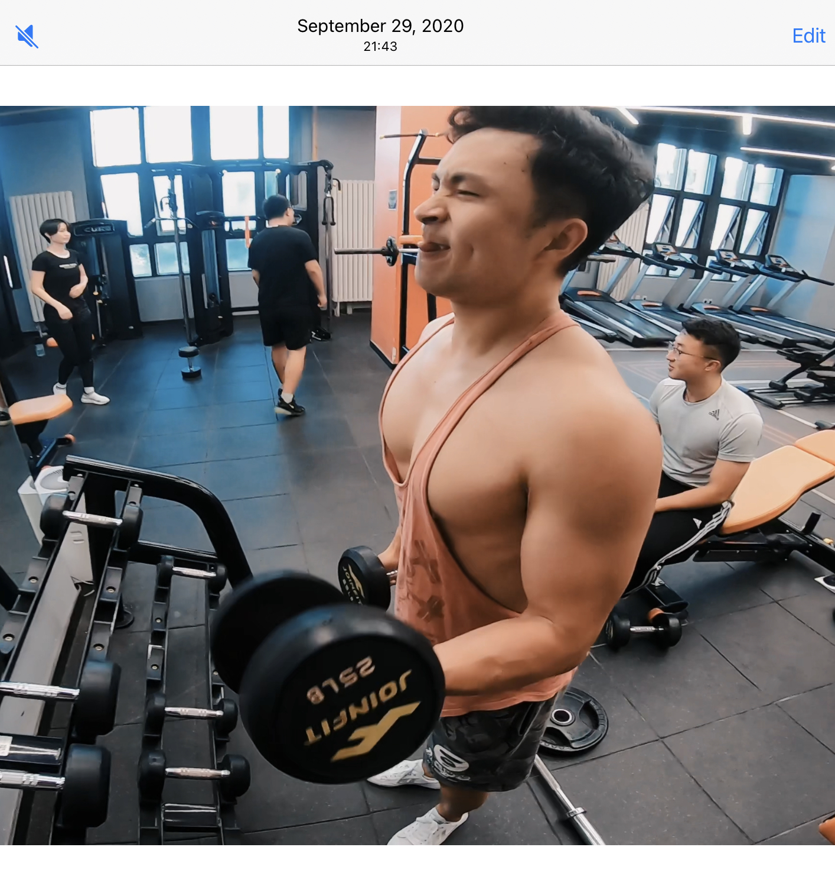
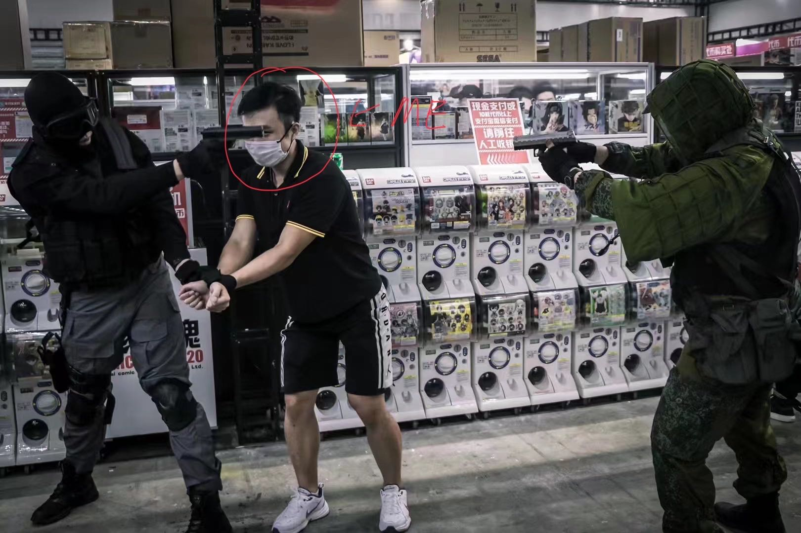
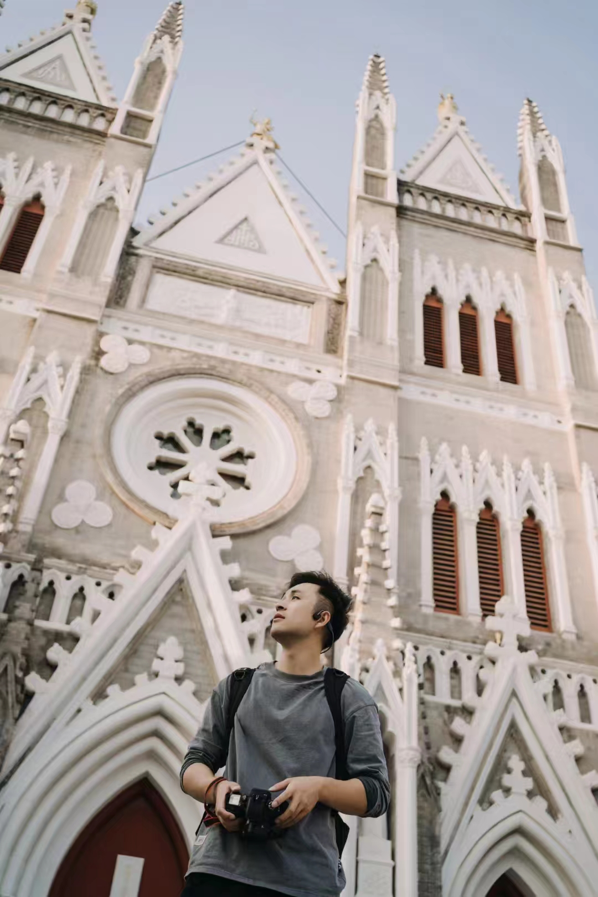

This is my about page. :wave:

Hello there! 😊I'm a vibrant graduate student specializing in International Relations within the sphere of Social Sciences. My academic journey has been marked by several published papers in my field, reflecting my deep interest and commitment to understanding global dynamics. you can visit [my homepage of CNKI](https://kns.cnki.net/kcms2/author/detail?v=xBNwvqFr00JloK2qyM4XitHR1JT7ASD_EIpf0YZDTbZmTOdTST4KuKP40KzHTz89vYW28rGD2NiyRBaXJdzJM-TX8Yewk0esMcEUqbszK19fhlLTW-gMXpFqy6yYyENC&uniplatform=NZKPT&language=CHS).

Photography is my creative escape📸. I co-founded a small studio where I channel my artistic flair into creating promotional videos and portraits for companies and individuals alike. It's a world where my lens captures stories, one frame at a time.

In my pursuit of physical fitness💪, I've dedicated six years to strength training, focusing on powerlifting. I take pride in my personal record of lifting a whopping 480 kg across the three major lifts: bench press, deadlift, and deep squat. It's not just lifting weights; it's lifting my spirit!

I'm an avid gamer🎮. My gaming palette enjoys a mix of open-world adventures, role-playing, shooting, and action games. Titles like *The Witcher 3*, *The Elder Scrolls V: Skyrim*, and *Rainbow Six: Siege* keep me glued to the screen, exploring endless possibilities.

Hidetaka Miyazaki stands as my icon in the gaming world. His masterpieces '*Dark Souls* and *Elden Ring* have left an indelible mark on me, inspiring awe and admiration. In the academic realm, I look up to scholars like Francis Fukuyama and Thomas Piketty, whose insights into societal structures and economic inequalities have shaped my understanding of the world.

I keep a keen eye on global trade governance and the pressing issue of inequality⚖️. These subjects are close to my heart, driving my academic pursuits and shaping my world view.

Rooted in the coastal province of Shandong, China, and raised in the bustling city of Shanghai, my journey has been a blend of diverse experiences and cultures, fueling my passion for understanding the world in its myriad hues. I'm excited about where this journey will take me next!🌟

