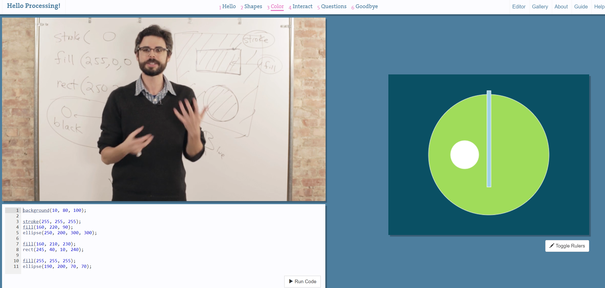
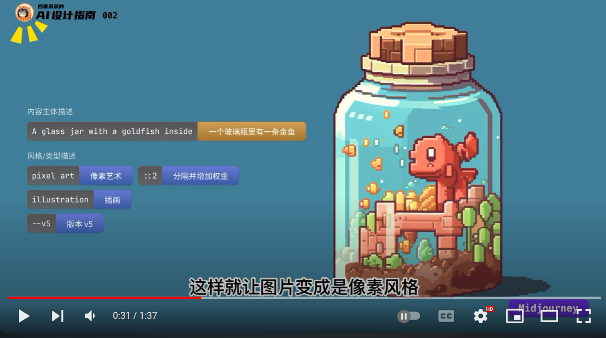
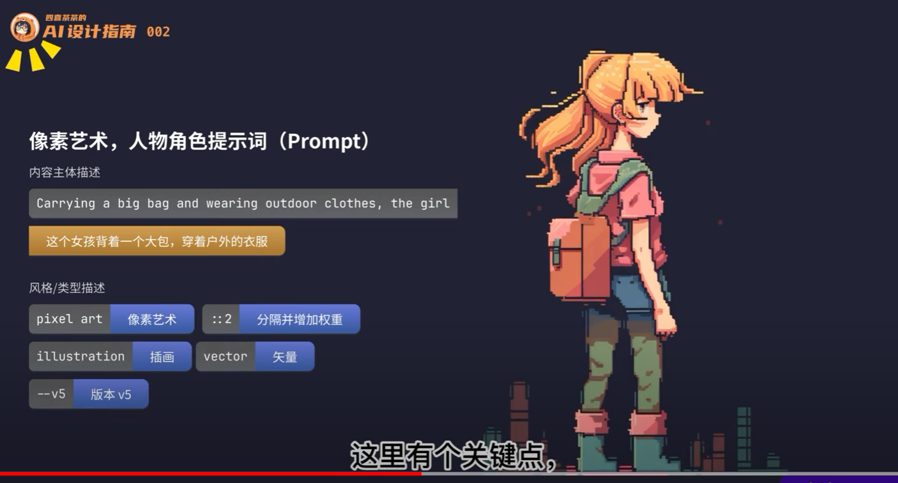
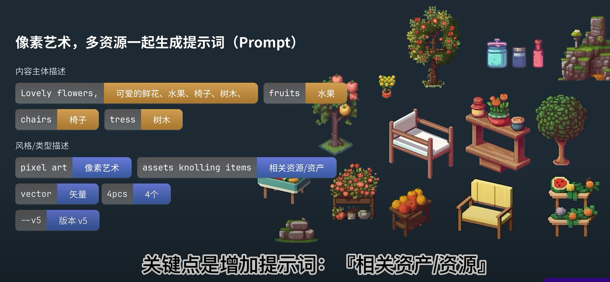
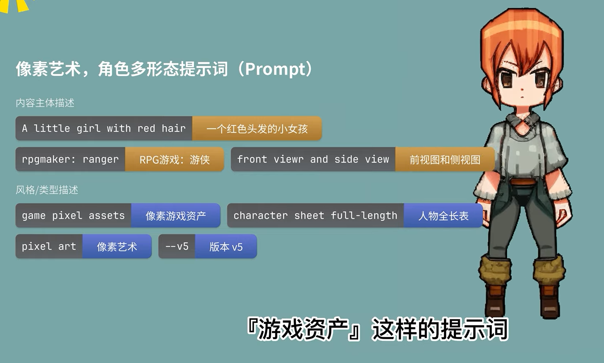

# 吃豆人-学术版 (ACADEMIC ADVENTURE)

## Overview

《学术冒险》是一款以学术为主题重新想象的吃豆人风格游戏。该游戏从复杂而有益的学术研究之旅中汲取灵感，玩家扮演好奇心旺盛的学者，在类似迷宫的学术世界中进行探索。这款基于网络的像素游戏是在EDITOR.P5JS平台上开发的，使用Processing语言来实现其独特概念。

**ACADEMIC ADVENTURE** is a reimagined Pac-Man style game with an academic twist. Drawing inspiration from the complex and rewarding journey of scholarly research, players assume the role of inquisitive academics, navigating through the maze-like world of academia. This web-based, pixelated game is developed on the EDITOR.P5JS platform, utilizing the Processing language to bring its unique concept to life.

In **ACADEMIC ADVENTURE**, players embark on a quest for knowledge, collecting points represented by books, papers, and research data, while evading personified academic challenges. These challenges include the Funding Fiend, symbolizing financial struggles; the Peer Review Phantom, representing the rigorous process of publication; the Methodology Maze Master, embodying experimental and analytical complexities; and the Career Competitor, reflecting professional pressures within academia.

The game incorporates humor and excitement in equal measure. Large Power-Ups in the form of groundbreaking discoveries empower players to temporarily overcome these academic obstacles, turning the tables on these challenges in a satisfying reversal of roles.

## Inspiration

 The game "Academic Adventure" is inspired by the intricate and often challenging journey of academic research, reminiscent of the intellectual pursuits in classic academia-themed novels and films. I've always been fascinated by the blend of challenge and discovery inherent in academic life. Haven't we all, at some point, navigated through the complex maze of scholarly endeavors, facing obstacles like funding issues, publication barriers, and methodological challenges, much like a game? This sparked the idea of transforming these academic pursuits into an engaging game experience.
《学术冒险》这款游戏的灵感来源于学术研究的复杂而充满挑战的旅程，这种感觉让人想起经典学术主题小说和电影中的智力追求。我一直对学术生活中固有的挑战与发现的结合深感着迷。难道我们在学术探索的过程中，没有像玩游戏一样，穿越知识的迷宫，面对资金问题、出版障碍和方法论挑战这样的障碍吗？这激发了我将这些学术追求转化为一种吸引人的游戏体验的想法。

Drawing from the humor found in the quirks and idiosyncrasies of academic life, "Academic Adventure" infuses a sense of light-heartedness into the serious world of research. It offers players a chance to step into the shoes of a scholar, navigating the maze of academia, collecting knowledge points, and tackling personified academic challenges. This game is an ode to every researcher's journey – a blend of ups and downs, triumphs and challenges, all wrapped up in an entertaining, cartoonish package.
从学术生活中那些古怪和独特之处中汲取幽默感，《学术冒险》为严肃的研究世界注入了一种轻松愉快的气息。它让玩家有机会扮演一名学者，在学术迷宫中导航，收集知识点，应对化身为学术挑战的障碍。这款游戏是对每个研究者旅程的赞歌——成功与挑战的混合体，所有这些都包裹在一个有趣的、卡通风格的包装中。

My aim with "Academic Adventure" is to create an enjoyable escape that resonates with anyone who has experienced the academic world, allowing them to relive, albeit in a whimsical and exaggerated manner, the exhilarating quest for knowledge and the thrill of overcoming scholarly obstacles. It's a playful tribute to the academic spirit, inviting players to revisit and realize a whimsical version of their scholarly pursuits.
我创建《学术冒险》的目的是为了创造一种愉快的逃避现实，与任何经历过学术世界的人产生共鸣，让他们以一种夸张而古怪的方式重温那种对知识的渴望和克服学术障碍的兴奋感。这是对学术精神的一种有趣的致敬，邀请玩家重温并实现他们学术追求中的奇思妙想。

## Game Design

Game rule

Players will take on the role of scholars, navigating through the labyrinth of the academic world. The objective is to collect as many knowledge points as possible while avoiding various academic challenges such as funding constraints, publication barriers, research methodology challenges, and professional competitors. Players need to find the symbol of a significant academic discovery within a set time limit, thereby escaping the academic maze to achieve victory in the game. If the player fails to find the "Great Discovery" within the allotted time or is caught by an academic challenge, the game will end in failure and restart.
玩家将扮演学者，在学术世界的迷宫中穿行，目标是在规定时间内收集尽可能多的知识点，并避开象征着各种学术挑战的障碍物，如资金限制、出版障碍、研究方法挑战和职业竞争对手。玩家需要在一定时间内找到象征着重大学术成就的“大发现”，从而逃离学术迷宫，取得游戏胜利。如果在规定时间内未能找到“大发现”，或者被学术挑战捕获，游戏将失败并重新开始。

The game rules are as follows:

1. **Role-Playing**: Players act as scholars actively seeking knowledge and academic achievements.
2. **Objective**: Collect knowledge points scattered across the game map and find the symbol representing a major discovery, all within a limited time (e.g., one minute).
3. **Avoiding Obstacles**: The game includes various obstacles representing different academic challenges, such as funding constraints and publication barriers. Players need to skillfully evade these challenges.
4. **Time Limit**: Players must complete the task within one minute. Failure to find the "Great Discovery" or getting caught by academic challenges before the countdown ends results in game failure.
5. **Victory**: If a player successfully collects all knowledge points and finds the "Great Discovery," they successfully escape the academic maze, and the game is won.
6. **Failure and Restart**: If caught by an academic challenge or if time runs out, the game restarts.

游戏规则详述如下：

1. **角色扮演**：玩家扮演一名积极寻求知识和学术成就的学者。
2. **目标**：在限定时间内（比如一分钟）收集游戏地图上散布的知识点，并找到代表重大发现的符号。
3. **避开障碍**：游戏中包含多种障碍，代表不同的学术挑战，如资金限制、出版障碍等。玩家需要巧妙规避这些障碍。
4. **时间限制**：玩家必须在一分钟内完成任务。倒计时结束前未找到“大发现”或被学术挑战捕获，则游戏失败。
5. **游戏胜利**：如果玩家成功收集所有知识点并找到“大发现”，则成功逃离学术迷宫，游戏胜利。
6. **失败与重启**：如果被学术挑战捕获或时间耗尽，游戏将重新开始。

Character Design

## Game Flow

For "Academic Adventure", I envision several exciting additions to enhance gameplay and user engagement. These include:

1. **Time Extension Artifact**: A special item that extends the time limit for a level. This could be represented as a 'Time Capsule' or 'Chrono Boost', giving players extra seconds to complete their objectives.
2. **Interactive Props**: Introducing interactive items such as 'Knowledge Scrolls' and 'Idea Lamps'. Collecting these would grant players bonus points or temporary abilities, like faster movement or temporary invulnerability to challenges.
3. **Distraction Tools**: Implement tools like 'Confusion Papers' or 'Rhetorical Questions' to momentarily distract or pause the academic challenges. These tools give players a strategic advantage to navigate through tougher sections of the game.
4. **Reward System Expansion**: Introduce new titles and achievements like 'Theory Master', 'Research Wizard', or 'Innovation Guru'. These titles are awarded for accomplishing specific tasks, like collecting a certain number of knowledge points or overcoming challenges without getting caught.
5. **Level Diversity**: Adding new levels with themes like 'Archival Adventure', where players navigate through historical documents, or 'Lab Labyrinth', exploring a complex laboratory setting. Each level will have unique challenges and aesthetics.
6. **Character Customization**: Allow players to personalize their scholar character with different outfits, accessories, and tools, enhancing the role-playing aspect of the game.
7. **Educational Aspects**: Incorporate fun facts and trivia related to various academic fields within the game. This could be implemented via interactive elements in the game's environment or as rewards for completing levels.
8. **Multiplayer Mode**: Introduce a cooperative or competitive multiplayer mode, where players can team up to solve challenges or compete to collect the most knowledge points.
9. **Mobile Compatibility**: Expand the game's accessibility by developing a mobile version, allowing players to enjoy "Academic Adventure" on various devices.

对于《学术冒险》游戏，我们设想了几项令人兴奋的新增内容，以增强游戏性和用户参与度。这些内容包括：

1. **时间延长神器**：一种特殊的物品，可以延长关卡的时间限制。这可以被设想为“时间胶囊”或“时间加速器”，给玩家额外的秒数来完成他们的目标。
2. **互动道具**：引入互动物品，如“知识卷轴”和“灵感灯泡”。收集这些可以给玩家奖励分数或临时能力，比如更快的移动速度或暂时对挑战免疫。
3. **分散注意工具**：实现如“混淆论文”或“修辞问题”之类的工具，暂时分散或暂停学术挑战。这些工具为玩家在游戏中更难的部分提供战略优势。
4. **奖励系统扩展**：引入新的称号和成就，如“理论大师”、“研究巫师”或“创新大师”。这些称号将授予完成特定任务的玩家，比如收集一定数量的知识点或在不被抓住的情况下克服挑战。
5. **关卡多样性**：增加新的关卡，主题包括“档案探险”，在这里玩家需要浏览历史文件，或“实验室迷宫”，探索复杂的实验室环境。每个关卡都将有独特的挑战和美学特色。
6. **角色自定义**：允许玩家用不同的服装、配饰和工具个性化他们的学者角色，增强游戏的角色扮演方面。
7. **教育元素**：在游戏中加入与各学术领域相关的趣味事实和小知识。这可以通过游戏环境中的互动元素实现，或作为完成关卡的奖励。
8. **多人模式**：引入合作或竞争的多人模式，玩家可以组队解决挑战，或竞争收集最多的知识点。
9. **移动兼容性**：开发移动版游戏，扩大游戏的可访问性，让玩家可以在不同的设备上享受《学术冒险》。

## Future Development

笔记

[像素风格提示词](https://www.youtube.com/watch?v=tR94Ff7gShM)

> 玻璃瓶中的金鱼提示词（Prompt） pixel art ::2 vector, A glass jar with a goldfish inside,illustration --v 5
> 户外背包女生提示词（Prompt） pixel art ::2 vector, Carrying a big bag and wearing outdoor clothes, the girl --v 5 
> 一起生成多物品提示词（Prompt） Pixel art ,Lovely flowers, fruits, chairs, trees,assets knolling items,vector --v 5
> 角色多视角提示词（Prompt） Pixel Art, character sheet full-length, rpgmaker: ranger, A little girl with red hair, front view and side view and back view, game pixel assets, black background --v 5

