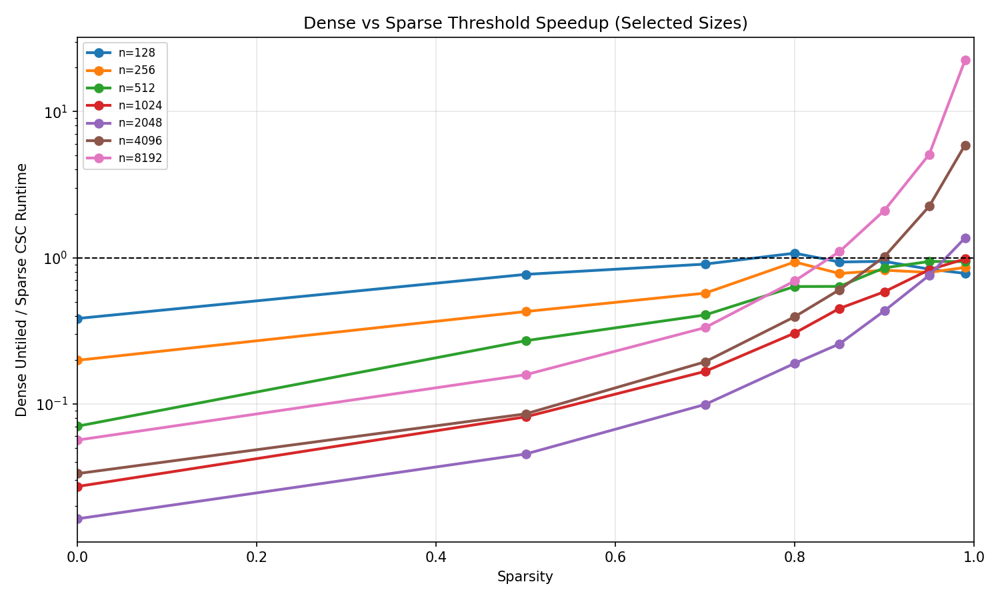

Skipping the zeros in a sparse matrix sounds like free speed, and on a GPU it often isn't. Compressed
storage replaces regular, coalesced reads with indirect indexing and binary search, and that
irregularity can cost more than the arithmetic it saves. The question worth answering is not *whether*
sparse wins but *where* it starts winning — and whether that point moves as the problem grows.

I wrote three CUDA LU factorization paths and benchmarked them against each other:

- **dense-untiled** — factorize the full matrix, eliminating below each pivot
- **dense-tiled** — the same, with shared-memory tiling to reuse pivots
- **sparse-CSC** — Compressed Sparse Column storage, factorizing only non-zero entries, using binary
  search to locate elements

Matrices ran from n = 128 to 8192 at sparsity levels from 0 to 99%, on an RTX 4060 locally and A100
nodes on TACC Lonestar6, with correctness verification on small cases and CUDA-event timing.

## Where the crossover sits

Above the dashed line, sparse wins. Two things stand out. Below roughly 80% sparsity dense is not
merely ahead, it is ahead by one to two orders of magnitude — at n = 2048 and a dense matrix the
sparse path is about 50× slower. And the crossover **moves left as matrices grow**: small matrices
only break even near 80% sparsity and never gain much, while at n = 8192 sparse pulls ahead around
85% and runs roughly 20× faster by 99%.

That matches the hypothesis we pre-registered: larger matrices waste more work in the dense kernel,
so sparse storage pays off at lower sparsity. The same experiment for matrix-vector multiplication
puts its crossover consistently lower, because SpMV is massively parallel while LU elimination is
chained by sequential dependencies and cannot convert sparsity into parallelism as directly.

A four-person course project. I implemented the LU kernels — dense untiled, dense tiled and sparse
CSC — and the benchmark pipeline behind the LU results above; the matrix-vector half of the report
was my teammates' work.
