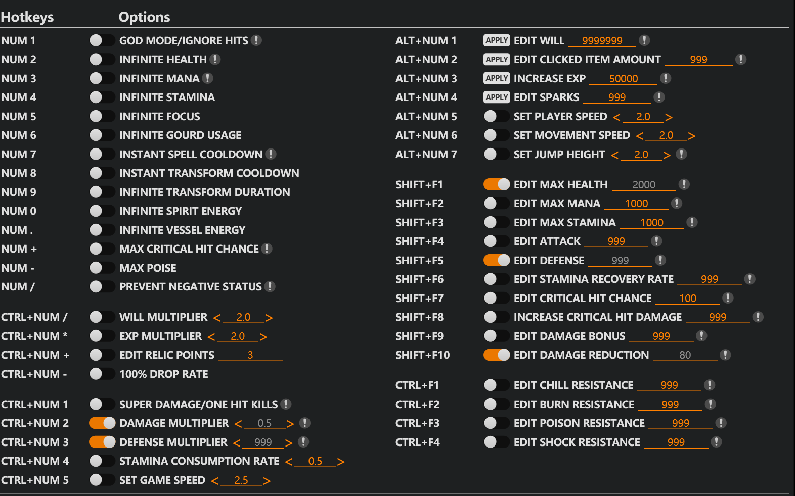

An action game boss is a small, brutal reinforcement learning problem: the state is whatever is on
screen, the reward arrives as health bars moving, and a wrong dodge ends the episode. This agent
plays the Wandering Wight in *Black Myth: Wukong* with no access to game memory — everything it knows
it reads off the screen.

## How it works

The screen is captured through the Win32 API and split into two streams. A YOLOv8 model detects which
of nine boss animations is on screen — jump attack, sweep, clap, boom, downed, and so on — while a
separate pass reads the player and boss health bars from fixed screen regions. Those four values
(action class, detection confidence, boss HP, player HP) form the state a DQN agent acts on, choosing
between light attack, heavy attack and forward dodge. The reward is simply damage traded: boss health
lost counts +30 per unit, player health lost −5.

Keeping the action space at three moves was deliberate. In a game where the correct response to most
attacks is a well-timed dodge, a larger action space mostly buys exploration cost.

## Results

| | |
|---|---|
| Episodes to first win | ~60 |
| Episode length | 200–300 steps |
| Loop rate | ~10 FPS, limited by game interaction |
| Outcome after training | Beats the boss consistently |

The limits are honest ones: it needs a YOLO model trained for each specific boss, it is Windows-only
because of the DirectX screen capture, and it assumes a lock-on camera. The obvious next step is
swapping the per-boss detector for zero-shot detection so the same agent can be pointed at a boss it
has never seen. Built for research and learning — the pre-trained boss detector came from FAN XU, and
the DQN scaffolding was inspired by the DQN_play_sekiro project.
