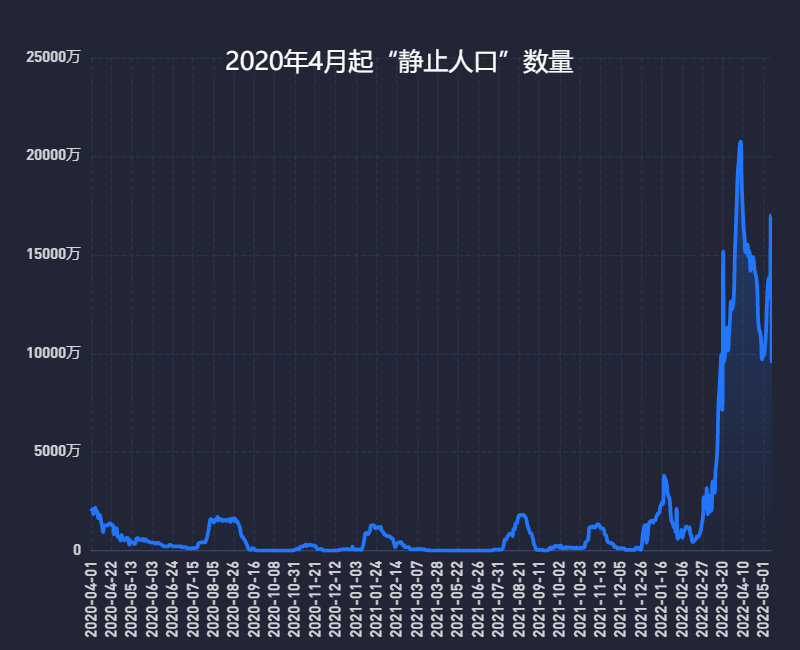
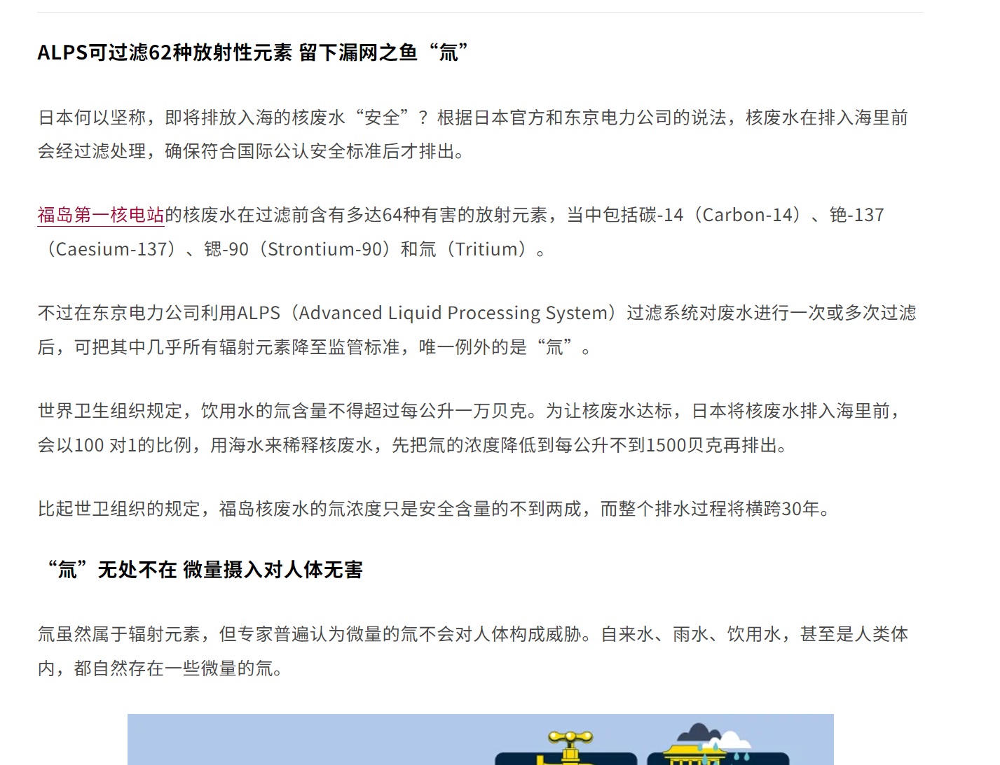

​	我想先从我想做社会科学研究的故事说起。

​	我对社会科学研究开始有兴趣是因为我曾经被多次叫过“那你是多余的啊”。

​	因为我小时候起码到高中之前，都一直是班级第一，我经常因为表现好而被老师们叫到办公室聊天。在听闻我是家里的弟弟之后，他们不止一次说过上一段这句话。因为那时计划生育的观点依然深入人心，大家默认家里先有个女孩的才会想要第二个，因而我这种有哥哥的就会被这么说。

​	我当时尽管没有很介意这句话，但还是在潜意识里记着了。我好奇我为什么会是多余的？为什么孩子会是社会的负担？这个问题伴随着我到现在。而在读过有关人口和经济增长之间关系的书籍后，我终于可以挺胸说，这个政策完全是bullshit。

​	在高中时期最好的就是数学化学，但我当时也很理想主义，不满足于跟计算打一辈子交道，因而选择了一个社会科学方向。当时抉择时我对这个学科基本一无所知，只是认为学好了可以当外交官，体面且可以实现自身理想。不过后来这些预设被一一击碎。一是国内国际关系专业培养基不规范，基本没有当作护城河的硬核技能，国内的研究范式也极度落后；二是外交官并没有这么光鲜，当下的中国这一职责更像是一个口舌而非大脑，外交官本质上还是政策的拥护和执行者，对于大政方针必须比普通人还坚决支持；三是国内社科学术大环境，一方面来自于政府，学者更多的是为了国家政策背书；另一方面是现存的大众舆论环境，学者往往会因为“逆天言论”出圈，现有真正讨论内容本身。

​	我因为有过一些发表陆续拿过校综合一等奖学金、国家奖学金和优秀毕业生等称号。在别人眼里我应该遵循着Timeline完成申请，但我无论在择校还是写RP时都有抵触情绪。之前择校时，我需要正襟危坐做好足够地心理建设才能开始浏览项目网页，心里想着“我不关心你研究啥，反正都没啥意义，反正可以换导师，你只要把我招进去我自己上课自己做别的项目。”彷佛是在做一道令人反感的作业而不是为自己的未来谋划。作为一个小镇错题家，我总是在重大节点按部就班地为了最大概率地走完下一步而选择最稳妥的方案。

​	我为什么会有抵触情绪？最让我学术理想破碎的瞬间之一是在疫情后期动态清零政策的一系列发展。那时北大国发院长姚洋就在学院公众号发文委婉地表达开放才能救经济，但是那篇文章最终被删除；另一边复旦教授领衔的“城市数据团”发布了一篇《2亿人口在4月静止》的文章，文章只是通过详细的数据分析了一个庞大的人群正在被封控，并没有更直接地说出某些政策建议，可惜仍然被封禁。

> **但在本轮疫情中，处于“交通静止“状态的人口已经超过了总人口的20%。**
>
> 影院“静默”**、**消费“静态”**、**交通“静止”**，这三项指标在此次疫情中都超过了20%。当一个地区的**三项指标全部满足**时，我们便将居住在这里的人口标记为**“静止人口”。
>
> 从2020年5月到现在，我们的**“静止人口”**到底有多少？
>
> 

>上图列出了三项指标全部满足的“**静止人口**“数量。可以看到，在**2022年之前，**任何一轮疫情中，全国的“静止人口”数量都**未曾超过2000万**。
>
>但在**奥密克戎疫情到来后**，2022年1月，“静止人口“数量就远超之前的纪录，逼近了5000万，**在4月上旬更是超过了1亿，甚至达到了2亿。*
>
>有一句谚语是：如果它看起来像鸭子、游泳像鸭子、叫声像鸭子，那么它可能就是只鸭子。

>我们把这句谚语改一改：2亿“静止人口“居住的城市，电影院完全关闭、城市消费低于去年同期50%、明明并非国定假日交通却如春节一般畅行无阻——那么这2亿人居住的城市，可能就是在“**静态管理**”。
>
>在这2亿人口中，我们还能看到许多极少在读者视野中出现的城市。如果从2020年5月开始算起，那么一共有**30个区县**的静止状态**超过100天**，其中一些具有代表性的区县包括——
>
>哈尔滨市的呼兰区，有182天处在静止状态。
>
>牡丹江市的爱民区，有162天处在静止状态。
>
>黑河市的爱辉区，有149天处在静止状态。
>
>张家口市的崇礼区，有142天处在静止状态。
>
>呼和浩特的和林格尔县，有135天处在静止状态。
>
>忻州市的五台县，有131天处在静止状态。
>
>安阳市的安阳县，有117天处在静止状态。

>晋中市的平遥县，有101天处在静止状态。
>
>防城港市的东兴县，有100天处在静止状态。
>
>……
>
>这些地区可能并未受到关注，甚至从未发布相关通知，但在各项数据维度中却实实在在地拥有了“**静态管理**”的所有特征。最近受到媒体关注的东兴县，在“静止状态持续时间“的维度上，甚至只是这个列表的最后一名。

《2亿人口在4月静止》节选（转自中国数字时代的存档）

​	后来动态清零政策的最终结局就有目共睹了，没有大规模准备退烧药、各地仍在兴建方舱医院等现象表明这是一次仓促的大撤退，而但推动这一政策瓦解地到底是哪个群体？是现实层面的协和医院早就在12月之前就被攻破而难以为继？是河南富士康那帮抄起家伙来反抗的工人？是全国各地此起彼伏的各高校、城市的异见活动？还是早就难以为继的政府和企业财政？**我并不确定，唯一确定的是，不是社科领域的学者。**

​	北大国发算得上是国内经济学的学术能力和学术界权力的小顶峰，但却仍然难以在此问题上有话语权；《人民日报》在社会情绪对动态清零政策不断悲观的背景下还搁这“为何要坚持动态清零政策”的文章。逼仄的公共议事空间让本来应该百家争鸣的社科学术在公众空间缄口。因而，我很难说服自己回国成为一个社科学者，这也就是我为什么并不想在国内读博，不想在国内继续做学术。学者基本工资来自政府财政收入而非市场化的竞争，更本质来说是纳税人的钱，因而学者天然具有转播公共知识的使命和学者。但显然，现在学者们并不会这么干了。

​	**万幸中的不幸是，很多早该像动态清零政策一样赶紧撤退的政策并没有像引起这一连串突发的危机，但他们的危害可能比long covid更可怕，比如计划生育政策。**

​	有人说等你做到足够大的位置就可以施展自己抱负了，上述已经击碎了这一假说。此外，President的博士论文就是关于户籍制度改革的，可现在呢？

​	而就在9月准备文书时，日本排“核污水”事件让我又一次悲观。因为我有很多朋友知道我学国际关系，他们也会半开玩笑地问怎么看，我的回答是“在不发生怪兽把核电站破坏了导致再次泄露的可预期的未来，我们不会因为日本排废水事件本身受到影响，我们至多会被国内的反日情绪和对日本的进口禁令而受影响”。因为他们之前曾问我如何看点正经的国际关系消息，我当时推荐过《世界知识》，但是世界知识上国关学者还搁这“日本不顾国际社会的强烈谴责....”。经验现象是：截至目前，世界上基本只有一个国家即中国对日本实施了海产品禁令，更为准确点是0.9个国家，因为作为中国一部分的中国台湾地区并没有实施禁令；而且中国只对日本实施了禁令，并没有对已经或即将被日本排海行为污染的俄罗斯、韩国、美国等实施禁令。当我的朋友念出了《世界知识》上的“国关学者”的文章的内容，我略尴尬地撤销了之前看的推荐，转而“还是多看看经济学人、FT、Bloomberg、联合早报吧，我给你推荐个我一直在用的可以免费解锁这些网站内容的插件....”在我上述提及的媒体报道里，日本排海都不是个热点事件。在西方眼里亲华的新加坡的《联合早报》，在排海前后发的[相关科普文章](https://www.zaobao.com.sg/news/world/story20230810-1422496，大意是在解释为何民众无需对日本排派产生恐慌。

《联合早报》：【世界大解说】福岛核废水排海 日本海鲜还能吃吗？

​	中文互联网世界也有科普的文章，不过存活不了多久都被删除，相关作者也被单位施压。我想，如果我已经是个某大学的老师，我也无法发一篇文章阐述不同于官方意识形态的观点吧。日本排海过去好几个月了，没有国家检测出有害物质超标并实施禁令，去日本的游客仍然络绎不绝。而当前，我的心态更像 节选自New Yorker 2023年10月的文章[《China’s Age of Malaise》](https://www.newyorker.com/magazine/2023/10/30/chinas-age-of-malaise)的一段文字。

> I spoke with a former banker who moved his family from Shanghai to Singapore, after concluding that his expertise on powerful people and their finances put him at risk. “Even though I love China, the nation is one thing and the government is another—it’s a group of individuals with power over the country for a brief period in the grand sweep of history,” he said. “I have no intention of overthrowing the government, nor do I have the ability. But there are truths that I believe Chinese citizens have the right to know. We’ve all been educated to say, ‘Better to keep our mouths shut.’ But this is wrong. When information doesn’t flow, the whole country will go backward.”
