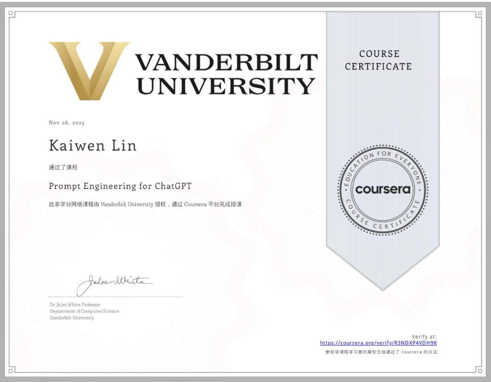

课程推荐：Google Coursera的[Prompt Engineering](https://www.coursera.org/learn/prompt-engineering/)

论文推荐：
[A Prompt Pattern Catalog to Enhance Prompt Engineering with ChatGPT](https://arxiv.org/abs/2302.11382)

Jules White, Quchen Fu, Sam Hays, Michael Sandborn, Carlos Olea, Henry Gilbert, Ashraf Elnashar, Jesse Spencer-Smith, Douglas C. Schmidt

#### [Chain-of-Thought Prompting Elicits Reasoning in Large Language Models](https://arxiv.org/abs/2201.11903)

Jason Wei, Xuezhi Wang, Dale Schuurmans, Maarten Bosma, Brian Ichter, Fei Xia, Ed Chi, Quoc Le, Denny Zhou

#### [ReAct: Synergizing Reasoning and Acting in Language Models](https://arxiv.org/abs/2210.03629)

Shunyu Yao, Jeffrey Zhao, Dian Yu, Nan Du, Izhak Shafran, Karthik Narasimhan, Yuan Cao

#### [ChatGPT Prompt Patterns for Improving Code Quality, Refactoring, Requirements Elicitation, and Software Design](https://arxiv.org/abs/2303.07839)

Jules White, Sam Hays, Quchen Fu, Jesse Spencer-Smith, Douglas C. Schmidt
